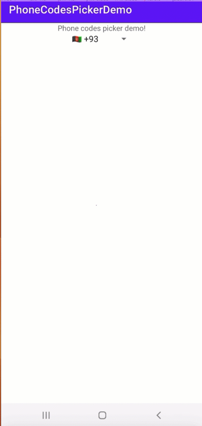

# PhoneCodesPicker
World countries phone codes picker library

The library returns list of the data containig code, flag and code and flag fields

Implementation steps

Step #1. 
Add it in your root build.gradle at the end of repositories:

	allprojects {
		repositories {
			...
			maven { url 'https://jitpack.io' }
		}
	}

Step #2
Add the dependency

	dependencies {
	        implementation 'com.github.farkhodkh:PhoneCodesPicker:0.0.1'
	}

Simple Demo

	

